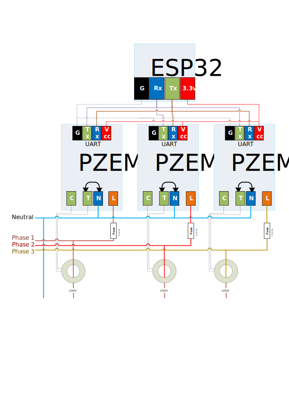

PZEM for 3-phase lines
======

A example diagram how to connect 3 PZEM devices to monitor 3 phase lines

PZEM box has two middle terminals shorted, be sure to connect **Neutral** there! Otherwise your CT coil would be connected to HOT wire all the time!

Don't be **naive** - protect live wires leading to PZEM with **fuses**! Any accident and you potentially could cross-short phase lines - it is much worse than shortcut to neutral or ground.

Leave this to the PRO's if you have no proper skills to work with high voltage equipment. It's only your liability, your own risk etc...

You've been **warned**!

  

NOTE:
 - PZEM measures differential between **Load** and **Neutral**, it won't handle properly pure 3-phase loads like async drives, 3-phase heaters, etc...
