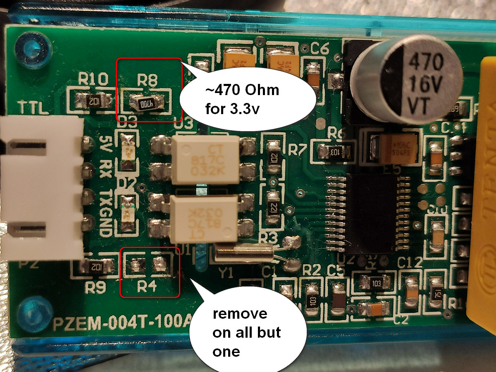

PZEM-EDL - PZEM event-driven library
======

__[BUILD](/docs/BUILD.md) | [EXAMPLES](/examples/README.md) | [CHANGELOG](/CHANGELOG.md) | [DOCS](/docs/README.md)__

PZEM - hardware mod
======

In order to connect multiple PZEM devices to a single ESP32 a certain modification required to original module:

 - make it 3.3 volt capable
 - make several PZEM to share same line

### 3.3 volts mod
ESP32 pins are declared as non-tolerant to 5 volts and PZEM requires to supply 5 volt Vcc to drive it's optocoupler.
So it is required to use either 3.3-to-5 volt logic converter or make a mod to PZEM board. (Or... take a risk and
use esp32 with 5 volts:) )

So, you need to replace a current limiting resistor __R8__ for RX line lovering it's value from default 1kOhm to somewhat about 300-500 Ohm.
Or you may also solder an additional 800 to 1k resistor on top of an existing one.

### Share UART lines mod
When connectting multiple devices to same RX/TX lines it might be that GPIO's/optocoupler's current capacity would not be enough to pull
the line levels. In that case it might help removing __R4__ resistor from TX path or lowering value even more for __R8__ RX path.
Be sure to leave at least ONE device with __R4__ inplace!

I was able to drive 3 PZEMs on the same line without removing __R4__.

  

[olehs WiKi](https://github.com/olehs/PZEM004T/wiki/Basic-Setup) - Basic-Setup

[olehs WiKi](https://github.com/olehs/PZEM004T/wiki/Make-PZEM-3.3v-compatible) - Make PZEM 3.3v compatible

[olehs WiKi](https://github.com/olehs/PZEM004T/wiki/Connecting-PZEM-to-ESP8266) - Connecting PZEM to ESP8266

[TheHWcave](https://github.com/TheHWcave/Peacefair-PZEM-004T-) - reverse-engineered schematics and interface software (python)
